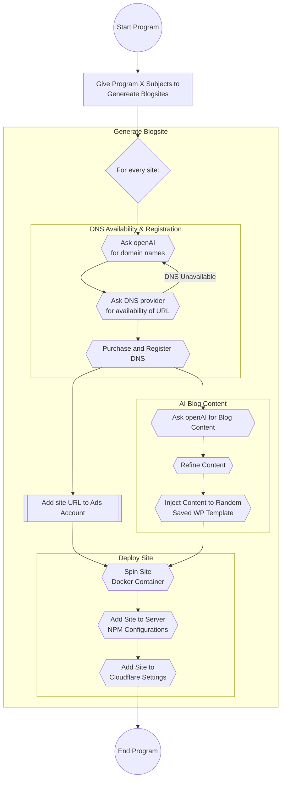

# blogsmaker

Dynamically generate blog sites.

## High Level Design

```mermaid
graph TB
A((Start Program)) --> B[Give Program X Subjects to \nGenereate Blogsites]
B --> C{For every site:}
subgraph Generate Blogsite
  C --> D{{Ask openAI \n for domain names}}
  subgraph DNS Availability & Registration
    D --> E{{Ask DNS provider \n for availability of URL}}
    E -- DNS Unavailable --> D
    E --> F{{Purchase and Register DNS}}
  end
  subgraph AI Blog Content
    F --> G{{Ask openAI for Blog Content}} --> I{{Refine Content}} --> J{{Inject Content to Random \n Saved WP Template}}
  end
  F --> H[[Add site URL to Ads Account]] --> K
  subgraph Deploy Site
    J --> K{{Spin Site \n Docker Container}} --> L{{Add Site to Server \n NPM Configurations}} --> M{{Add Site to \n Cloudflare Settings}}
  end
end
M --> N((End Program))
```
